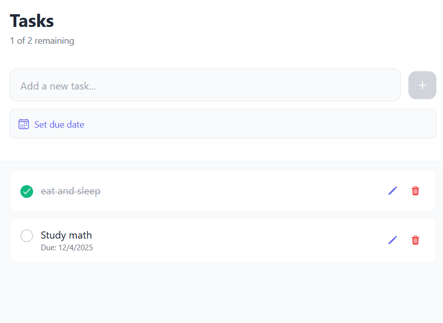
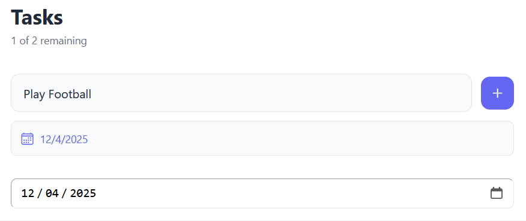
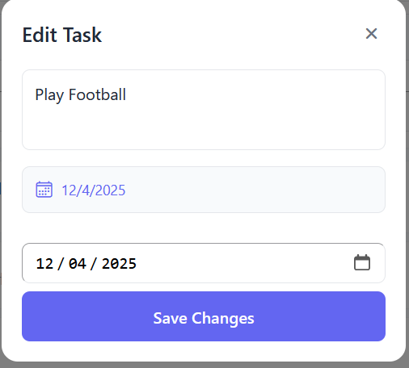

# Todo Notes App

## Overview

The **Todo Notes App** is a task management application that allows users to create, update, delete, and manage their tasks efficiently. It includes features such as setting due dates for tasks, marking tasks as completed, and editing tasks. The app is built using **React Native** and integrates with **Firebase Firestore** for real-time data persistence.

## Feature

1. **Add Tasks**:
   - Users can add new tasks by entering a title and optionally setting a due date.
   - Tasks are saved to Firebase Firestore for real-time synchronization.

2. **View Tasks**:
   - All tasks are displayed in a clean and organized list format.
   - Tasks are categorized as completed or pending based on their status.

3. **Edit Tasks**:
   - Users can edit the title and due date of existing tasks.
   - Changes are updated in real-time in Firebase Firestore.

4. **Mark Tasks as Completed**:
   - Users can toggle the completion status of tasks by clicking on the checkbox.

5. **Delete Tasks**:
   - Users can delete tasks, which removes them permanently from Firebase Firestore.

6. **Set Due Dates**:
   - Users can set or update due dates for tasks using a reusable date picker component.

7. **Responsive UI**:
   - The app is designed with a clean and modern UI, ensuring a smooth and intuitive user experience.

## How to Run the App

Follow these steps to run the app on your local machine:

1. **Clone the Repository**:
   ```bash
   git clone <repository-url>
   cd <repository-folder>
   ```

2. **Install Dependencies**:
   ```bash
   npm install
   ```

3. **Start the Development Server**:
   ```bash
   npm start
   ```

4. **Open the App**:
   - Use the Expo Go app on your mobile device to scan the QR code displayed in the Expo Developer Tools.
   - Alternatively, run the app on an emulator or simulator.

## File Structure

The app is organized into the following layers:

### 1. **Persistence Layer (`persistence/TodoPersistence.ts`)**
   - Handles all interactions with Firebase Firestore.
   - Functions:
     - `fetchTodosFromDB`: Fetches all tasks from Firestore.
     - `addTodoToDB`: Adds a new task to Firestore.
     - `updateTodoInDB`: Updates an existing task in Firestore.
     - `deleteTodoFromDB`: Deletes a task from Firestore.

### 2. **Business Logic Layer (`businessLogic/Todo.ts`)**
   - Defines the `Todo` interface, which represents the structure of a task.
   - Includes validation logic for task titles.

### 3. **Service Layer (`service/TodoService.ts`)**
   - Acts as a bridge between the UI and the persistence layer.
   - Manages the state of tasks and provides functions for adding, updating, and deleting tasks.

### 4. **UI Layer (`app/Notes.tsx`)**
   - The main user interface of the app.
   - Features:
     - Displays a list of tasks.
     - Provides input fields for adding and editing tasks.
     - Integrates the `DatePicker` component for setting due dates.

### 5. **Reusable Components**
   - **DatePicker (`components/DatePicker.tsx`)**:
     - A reusable component for selecting dates.
     - Supports both web and native platforms.

## How It Works

1. **Landing Page**:
   - The `Notes.tsx` file serves as the landing page of the app.
   - It displays the list of tasks and provides options to add, edit, or delete tasks.

2. **Adding a Task**:
   - Users can enter a task title and optionally set a due date.
   - Clicking the "Add" button saves the task to Firestore.

3. **Editing a Task**:
   - Users can click the edit icon next to a task to modify its title or due date.
   - Changes are saved to Firestore in real-time.

4. **Marking a Task as Completed**:
   - Clicking the checkbox toggles the completion status of a task.

5. **Deleting a Task**:
   - Clicking the delete icon removes the task permanently.

6. **Setting Due Dates**:
   - Users can set or update due dates for tasks using the `DatePicker` component.

## Screenshots

### 1. Task List


### 2. Add Task


### 3. Edit Task


## Technologies Used

- **React Native**: For building the user interface.
- **Firebase Firestore**: For real-time data storage and synchronization.
- **Expo**: For simplifying the development and testing process.
- **TypeScript**: For type safety and better code maintainability.

## Future Enhancements

- Add support for task prioritization.
- Implement notifications for tasks with upcoming due dates.
- Add user authentication for personalized task management.
- Introduce task categories or tags for better organization.

## Conclusion

The Todo Notes App is a simple yet powerful task management tool. It demonstrates the use of React Native, Firebase, and TypeScript to build a responsive and feature-rich application. The app is designed to be intuitive and user-friendly, making it easy for users to manage their tasks efficiently.
